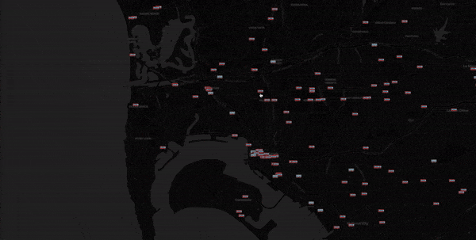

# San Diego Public Transportation Visualization
This project allows you to view real-time data from SDMTS. You can view the real-time locations of buses and trolleys in San Diego. You can also click on a vehicle to view its route live on the map, and see upcoming stops and arrival times.

## Live Demo
Loading times may vary, this is deployed on slow shared hosting
[Live Demo](https://owenpk.com/sides/mts "Live Demo")

## How to Run on Your Own
1. Download or clone repository to a server with PHP + SQL installed
2. Import the SQL tables using the included [SQL File](./mts.sql)
3. Edit the values in [config.php](./php/config.php)
	1. Set the `CSRF_TOKEN_SECRET` to a long random string
	2. Set your database credentials to match where you imported the sql tables
	3. Set your API key which you must obtain from SDMTS https://www.sdmts.com/business-center/app-developers/real-time-data

